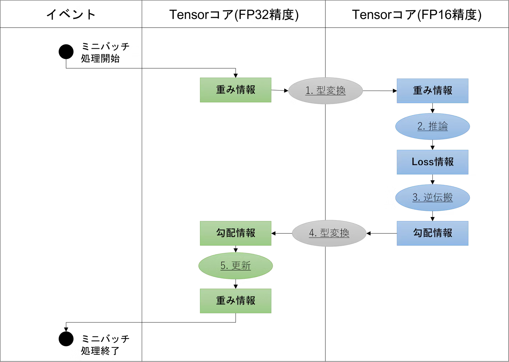
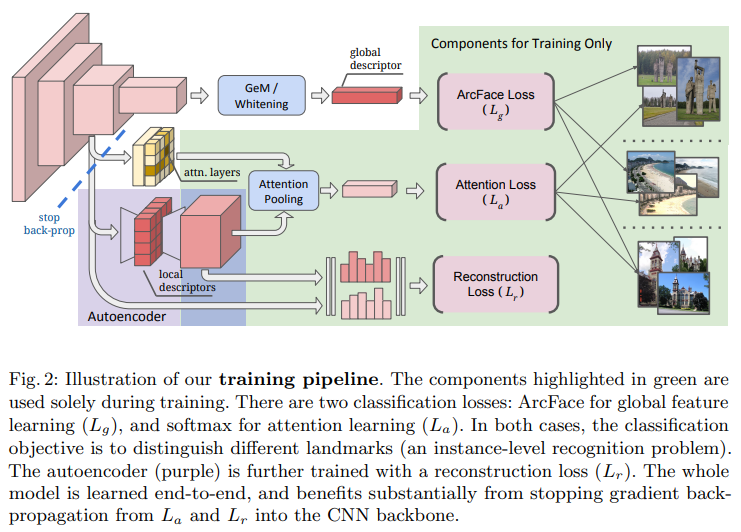

画像検索分野ではじめてend-to-endの学習を可能とした深層学習モデルについて，改めて詳細を纏めてみました。
- Title: [Unifying Deep Local and Global Features for  Image Search](https://www.bing.com/ck/a?!&&p=a15e6de4f298f5f064ae8b4cedd15cd9e56747344a730f3dd39e06d45b2b5d8dJmltdHM9MTc0NDQxNjAwMA&ptn=3&ver=2&hsh=4&fclid=36f718b3-72b8-6b12-316c-0d8d737c6a48&psq=Unifying+Deep+Local+and+Global+Features+for++Image+Search&u=a1aHR0cHM6Ly9hcnhpdi5vcmcvYWJzLzIwMDEuMDUwMjc&ntb=1)
- Conference: ECCV2020
- Code: https://github.com/tensorflow/models/tree/master/research/delf

# Background
- 画像検索の性能を左右するのは画像をどう特徴ベクトルとして数値化するかという点。この表現には主に2種類ある。
  - グローバル特徴 (Global Features): 画像全体を纏めて1つの特徴ベクトルに圧縮したものであり，画像全体の雰囲気を掴む。高速だが，局所構造を失うため細かなマッチングには弱い。Recallに強い (見逃しが少ない) 。
  - ローカル特徴 (Local Features): 複数の画像領域を小さな特徴ベクトル(＋その位置)に圧縮したもの。精密な位置関係や剛体物体に強いが，処理が重くなりがち。Precisionに強い (間違えにくい)。
- 本論文の貢献は以下。
  - グローバル特徴とローカル特徴を1つのCNNで抽出可能とした。具体的にはGeMプーリングでグローバル特徴を効果的に集約し，Attentive Local Feature Detectionで重要な領域を重点的に検出してローカル特徴を抽出。
  - AutoEncoderをCNNに統合することで低次元のローカル特徴を直接学習可能とした (従来，ローカル特徴は高次元で表現されており，後処理でPCAなどが必要となることが多かった)。これにより高速にend-to-endな学習が可能となった。
  - 画像単位のラベル (シンプルなクラスラベル) だけでend-to-endの学習を実現。
  - 有名なベンチマーク(Revisited Oxford, Revisited Paris, Google Landmarks v2)でSOTA達成。

# Method
## Architecture

- グローバル特徴は同じ対象の画像であれば全体的に「似たベクトル」になるように学習される一方で，ローカル特徴は画像内の局所領域ごとの一致を高精度で判断できるように学習される (グローバル特徴は抽象/意味重視，ローカル特徴は具体/空間重視)。そのため，CNNでこれら異なる性質を同時に学習するのは難しい。
- 本研究で提案するDELG (DEep Local and Global features) は従来の複雑な多段階学習を排除し，シンプルにend-to-endな学習を実現。
- CNNに入力画像を通すと空間的な局所特徴を保持した浅い層の特徴と抽象的で意味的な表現を持つ深い層の特徴の2種類の特徴マップが得られる (深い層ほど空間サイズが小さくチャンネル数が多くなる)。
- 以下式に示す[GeMプーリング](https://paperswithcode.com/method/generalized-mean-pooling)で得たベクトルに全結合層 (全結合層＋バイアス) を通すことで次元変換を行い**グローバル特徴**を抽出する。

$$
 g = F \cdot \left( \frac{1}{H_D W_D} \sum_{h,w} d_{h,w}^p \right)^{1/p} + b_F
$$

- **ローカル特徴**は意味のある領域を選択しつつ，低次元化の必要がある (ローカル特徴は数百~数千個に及ぶため高次元だと重すぎる) 。
  - 重要領域の選択 (Attentionモジュール): 浅い層から得られる特徴マップを入力としてAttentionによりどの位置が重要かを表すスコアマップを生成。($S \in \mathbb{R}^{H_S \times W_S \times C_S}$ → $A \in \mathbb{R}^{H_S \times W_S}$)
  - ローカル特徴のコンパクト表現 (AutoEncoderモジュール): ル雨情のローカル特徴は高次元のため，AutoEncoderを用いて浅い特徴から低次元の表現を学習 (出力は$S \in \mathbb{R}^{H_S \times W_S \times C_S}$ → $L \in \mathbb{R}^{H_S \times W_S \times C_T}$となりチャンネル数を削減できる)。これによりメモリや計算コストを削減。ここで，圧縮後の特徴は表現力を高めるために正負の符号付き。
- 最終的には，各位置 ($h, w$) において「低次元表現に変換した特徴ベクトル」「Attentionにより得られた信頼度スコア」「位置情報　($h, w$は圧縮された特徴マップ上の位置であるため，圧縮前画像ではどこかということを示している。つまり受容野の中心位置)」という3要素を持ったローカル特徴が得られる。
- 最終的にはローカル特徴とグローバル特徴を以下のように正規化。

$$
\hat{l}_{h,w} = \frac{l_{h,w}}{||l_{h,w}||_2}, \quad \hat{g} = \frac{g}{||g||_2}
$$
## Training

- 元々ローカル特徴の学習にはパッチ単位のラベル (画像内の特定領域が何を表しているか) が必要であり，手動ラベリングと学習に際するコストが非常に高かった。本手法だと，画像単位の分類ラベルだけでローカル特徴も学習させるアプローチをとっている。そもそもパッチ単位のラベルでは「画像単位の分類ラベル」を区別するのに効く特徴を選べるとは限らない。それに対して本手法だと画像単位のクラスを正しく判別するために有効な特徴を学習することができる。

**グローバル特徴:**
- グローバル特徴: ArcFace margin＋Cosine類似度によるSoftmaxのCrossEntropyLossにより学習する。

$$
L_g(\hat{g}, y) = - \log \left( \frac{ \exp(\gamma \cdot AF(\hat{w}_k^T \hat{g}, 1)) }{ \sum_n \exp(\gamma \cdot AF(\hat{w}_n^T \hat{g}, y_n)) } \right)
$$

- このとき，式中の$AF$ (ArcFace marginにより強化されたコサイン類似度)は以下で定義される。

$$
\text{ArcFace調整式:} \quad
AF(u, c) = 
\begin{cases}
\cos(\arccos(u) + m), & \text{if } c = 1 \\
u, & \text{if } c = 0
\end{cases}
$$

