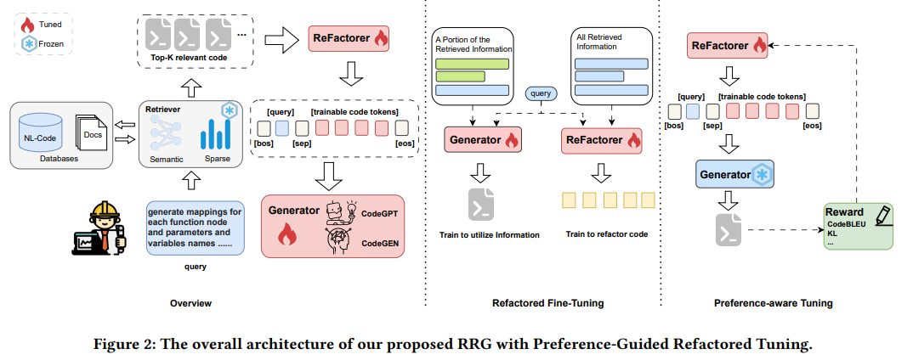

# [Preference-Guided Refactored Tuning for Retrieval Augmented Code Generation](https://arxiv.org/abs/2409.15895)
- Retrieval-augmented
code generation (RACG) はコード生成能力を強化する可能性が大きく，ロングテール問題 (稀なケースに弱い) にある程度対応できる。
- しかし，RACGは以下問題点がある。
  - retrieverが無関係な情報を取り込んでしまい，generatorに悪影響を与える。また，generatorに入力する際のコンテキスト長の制限に引っかかる可能性が高くなる。(ある指標に基づき不要なトークンを除外する手法が試されてきたが限界がある)
  - retrievalしたコード(正解に近いコード)が効果的なコード生成を促すとは限らない。generatorは，正解のコードよりも「処理のしやすさ」「情報の新しさ」を重視する可能性があるため，retrieveしたコードを活かしきれない。
- 本研究ではrefactorerを訓練してgeneratorの好みに合った形でコードをリファクタリング (情報を圧縮) できるようにする方法を提案。これにより，先の課題を解決。

| ステージ | 内容 | 目的 |
|----------|------|------|
| **第1段階** | 教師あり学習（SFT） + 外部知識の注入 | リファクタラを生成的圧縮ができるよう訓練する |
| **第2段階** | 強化学習（RL）でrefactorerをチューニング | generatorの好みに近い出力を得るための調整（preference gap解消） |

**Related Work**:
- 元のLLMをベースにコードだけにだけに絞った追加学習を施すことでコード生成・理解能力を大幅に強化している。以下はコード特化のモデル。
  - CodeLLaMA: Meta社の LLaMA をベースにコード特化で学習したモデル
  - CodeGeex: 多言語コード生成が得意な中国発のモデル
  - AST-T5: T5というLLMにコードの構文的な複雑性（AST情報）を取り込んでいる
  - CodeGEN: 対話ベースのモデル
- これまでRAGのpipelineを主に3つの観点で最適化している。Whatで情報源と粒度を最適化し，余計なコンテキストを削る。Whenで検索タイミングを動的に変更し，必要最小限の呼び出しで高精度化。Howでプロンプト長や計算コストを抑えつつモデルが利用しやすい形に加工。

| 視点 | キーとなる問い | 代表的な研究・手法 | 概要 |
|------|---------------|--------------------|------|
| **What** （何を取り込むか） | *どんな単位の情報を LLM に与えると効果的か？* | - **検索エンジン結果**（Web 検索）[19, 26] - **ナレッジグラフ**（エンティティ間の関係）[43, 53] - **フレーズ**（短文）[17, 28] - **トークン**（単語レベル）[16] - **チャンク**（段落など）[49] | 取り込む情報の粒度やソースを変えることで、冗長性を減らしつつ必要な知識を届ける試み。 |
| **When** （いつ取得するか） | *生成プロセスのどのタイミングで検索を挟むか？* | - **一括取得**（従来型）: 生成前にまとめて検索。 - **Flare**[13]: 途中で「必要になったら追加検索」する **適応的リトリーバル**。 - **Self‑RAG**[2]: 生成後に自己反省し、必要なら再検索して回答を改善。 | 「生成前に 1 回だけ検索」では不足する場合があるため、**逐次・反復的に検索**して精度と効率を両立。 |
| **How** （どう使うか） | *取得した情報を LLM にどう食べさせるか？* | - **RECOMP**[54], **PRCA**[57]: 重要部分だけを **圧縮・抽出** してプロンプトを短く。 - **RETRO**[4, 50]: 取得文を **ベクトル化してモデル内部に直接注入** し、推論時に参照。 | 入力トークン数の制限やノイズ混入を避けるため、**情報の圧縮・選別・内部統合** 技術が鍵になる。 |

**Method**:

本手法の詳細: https://zenn.dev/link/comments/810c528cf5db16
