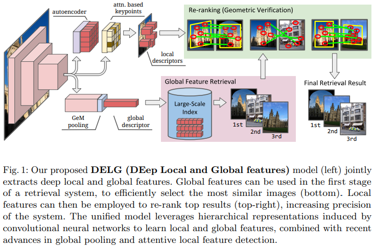

NeurIPS2024の発表の中で気になった物体検出分野の研究をピックアップ。勉強がてらそれぞれの研究の概要を以下に纏めた。

# [Adaptive Important Region Selection with Reinforced Hierarchical Search for Dense Object Detection](https://neurips.cc/virtual/2024/poster/94227)
- dense object detectionは様々なドメインに適用されている一方で非常に難しいタスクである。アンカーベースの1ステージ型物体検出器は，複雑かつノイズの多い背景を持つ場合に，多様なタイプの候補アンカーを捉えられず，多くの偽陽性アンカーが生じてしまう。
- 本研究では，独自に設計された報酬関数を用いてEvidential Q-learningを行うエージェントにより適応重要領域選択(AIRS:Adaptive Important Region Selection)を実施することを提案する。本手法は物体があるかどうかはっきりしない不確実性が高い領域を積極的に探索するように設計されている，かつむだな探索を減らすような仕組みになっているため高速に収束させつつ精度向上をさせられる。

- FPNの各スケール(P5が最も低い解像度でP3が最も高い解像度)のパッチからRLエージェントが有効なパッチを選択，それが特徴抽出器を通過し，次にRNNを通じて状態表現が生成される。
- 状態表現はEvidential Q-networkを通過してEvidential Normal-Inverse Gaussian(NIG)を形成した後可能なアクションのQ値を推定する。NIGはQ値に加えてその認識不確実性もモデル化する
- 推定Q値に対応する認識不確実性を組み合わせることによって不確実正が高いパッチを優先的に探索しつつトレーニングが進につれて不確実性を減らし，価値の高いアクションに収束させていくことができる。

# [Progressive Exploration-Conformal Learning for Sparsely Annotated Object Detection in Aerial Images](https://neurips.cc/virtual/2024/poster/95684)

- 大量のデータにアノテーションするのは高コストなため，限られたアノテーション付きサンプルと大量の未アノテーションサンプルを利用して性能を向上させる半教師あり物体検出(SSOD:semi-superbised object detection)が提案されている。SSODは一般画像に商店を当てており，航空画像における独自の画像特性を考慮することができない(上図に示すように一般画像と比べて航空画像は物体が密で類似している)。
- 本研究では，航空画像におけるスパースにラベル付けされた物体検出タスク(SAOD:sparsely annotated object detection)に焦点を当てる。つまり，ごく一部の物体しかアノテーションされていない画像からうまく物体検出するタスク。
- 従来手法だと疑似ラベルを用いた手法が一般的だが，固定の閾値により疑似ラベルを付ける対象をフィルタリングする。しかし，航空画像だと飛行機のような特徴が明瞭な画像だと検出スコアが高いが，小型の車両だとスコアが低くなりがち。そのため，大きい物体と小さい物体で信頼度が異なるなどのクラス毎の不均衡を考慮しながら疑似ラベルを適切に探索・活用できるPECL(Progressive Exploration-Conformable Learning)を提案する。

- 

# [Training-Free Open-Ended Object Detection and Segmentation via Attention as Prompts](https://neurips.cc/virtual/2024/poster/94761)

# [YOLOv10: Real-Time End-to-End Object Detection](https://neurips.cc/virtual/2024/poster/93301)

# [DI-MaskDINO: A Joint Object Detection and Instance Segmentation Model](https://neurips.cc/virtual/2024/poster/93369)

>Appendix:
>https://zenn.dev/giba/scraps/bd364ef8e2112e